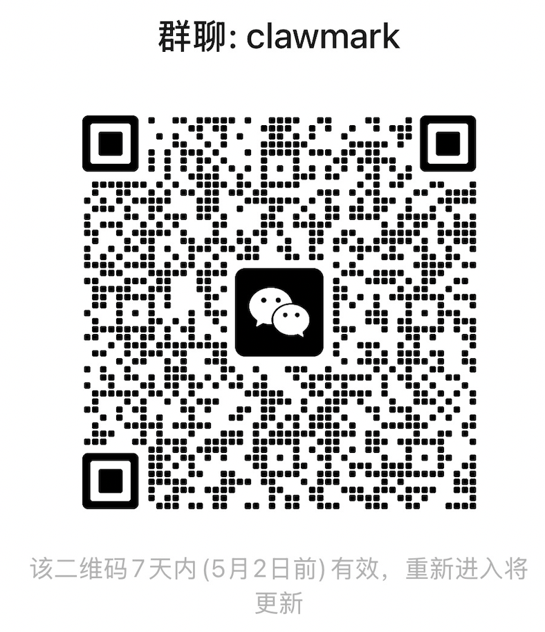

# ClawMark

[![Evolvent AI][evolvent-image]][evolvent-url]
[![Discord][discord-image]][discord-url]
[![X][x-image]][x-url]
[![WeChat][wechat-image]][wechat-url]
[![Hugging Face][huggingface-image]][huggingface-url]
[![Star][star-image]][star-url]
[![License][license-image]][license-url]

A **multimodal · multi-stage · multi-environment** daily-work benchmark for coworker agents. 100 tasks span 13 professional domains (clinical, HR, legal, PM, real estate, research assistant, journalist, insurance, investment analyst, executive assistant, content operation, ecommerce, EDA). Each task simulates 1–3 working days of a real job and stress-tests the model's ability to make continuous decisions across tools, multimodal evidence, and timelines.

## Features

- **Timeline-driven multi-stage tasks** — Each task is built from 1–3 stages, where each stage corresponds to one working day (e.g. Mon 3/16 → Tue 3/17 → Wed 3/18). The agent receives that day's instructions, carries out the work against real tool backends, and only then does the framework advance to the next day.
- **Cross-environment tool coordination** — Tasks mix filesystem, email (GreenMail), Notion (mock), Google Sheets (mock), and Calendar (Radicale CalDAV) backends, forcing the model to cross-reference and reconcile information across multiple systems.
- **Multimodal raw evidence** — `assets/input/` contains screenshots, photos, PDFs, CSVs, audio, and video. The model has to extract key information directly from raw evidence — there are no pre-digested text summaries.
- **Implicit state changes** — Environment data mutates between stages (new email arrives, database rows get updated, files are appended, calendar events shift). The model has to proactively refresh external state rather than just react to the latest instruction.
- **Strict rule-based scoring** — Every task ships with 10–25 deterministic Python checker functions. **Zero LLM-as-judge.** Results are 100% reproducible.

## Results

`avg@3` leaderboard across **100 tasks × 6 models × 3 runs**:

| Model | avg@3 | turns / task | input tokens / task | output tokens / task |
|---|---:|---:|---:|---:|
| openai/gpt-5.4 | **0.5504** | 24.5 | 905k | 17.3k |
| anthropic/claude-sonnet-4.6 | 0.5492 | 48.3 | 3.03M | 24.9k |
| qwen/qwen3.6-plus | 0.4981 | 41.4 | 2.89M | 35.8k |
| google/gemini-3.1-pro-preview | 0.3934 | 42.9 | 1.62M | 7.3k |
| minimax/minimax-m2.7 | 0.3437 | 33.7 | 1.70M | 18.0k |
| moonshotai/kimi-k2.5 | 0.2686 | 18.1 | 866k | 9.1k |

### avg@3 by domain

| Domain | n | gpt-5.4 | claude-4.6 | qwen3.6 | gemini-3.1 | minimax-m2.7 | kimi-k2.5 |
|---|---:|---:|---:|---:|---:|---:|---:|
| clinical_assistant | 4 | 0.7313 | 0.5538 | 0.6838 | 0.3523 | 0.4466 | 0.3945 |
| content_operation | 12 | 0.5461 | 0.5362 | 0.5823 | 0.3931 | 0.3149 | 0.2714 |
| ecommerce | 9 | 0.4909 | 0.4864 | 0.4244 | 0.3737 | 0.1828 | 0.2229 |
| eda | 1 | 0.7826 | 0.5072 | 0.9420 | 0.7246 | 0.0870 | 0.0870 |
| executive_assistant | 7 | 0.5042 | 0.3256 | 0.5176 | 0.3794 | 0.2830 | 0.2540 |
| hr | 11 | 0.5664 | 0.5707 | 0.5281 | 0.3639 | 0.4131 | 0.2187 |
| insurance | 7 | 0.7880 | 0.8007 | 0.6384 | 0.4931 | 0.6086 | 0.3666 |
| investment_analyst | 6 | 0.4847 | 0.5935 | 0.2103 | 0.5701 | 0.5975 | 0.3466 |
| journalist | 8 | 0.4593 | 0.4781 | 0.3431 | 0.4660 | 0.1861 | 0.1188 |
| legal_assistant | 6 | 0.3531 | 0.6338 | 0.2981 | 0.5040 | 0.2877 | 0.2070 |
| pm | 8 | 0.3723 | 0.3846 | 0.3149 | 0.1360 | 0.2060 | 0.1605 |
| real_estate | 6 | 0.7828 | 0.6022 | 0.6970 | 0.5263 | 0.4479 | 0.3860 |
| research_assistant | 15 | 0.5807 | 0.6229 | 0.5953 | 0.3061 | 0.3437 | 0.3540 |

### Metric definitions

- **`avg@3`** — Each task is run 3 times independently; the 3 `score` values are averaged, then averaged again across the 100 tasks. `score` is the 0–1 weighted pass-rate, where weights come from each checker's `weight` field.
- **`turns / task`** — Number of assistant messages (model–tool interaction rounds) per task, averaged over 3 runs and then across all 100 tasks.
- **`input tokens / task`** — Sum of prompt tokens across every turn. **`cacheRead` and `cacheWrite` are merged into `input`**, so the number reflects the total context the model actually had to process. This normalizes across providers regardless of whether prompt caching was enabled.
- **`output tokens / task`** — Sum of completion tokens across every turn.

Some providers (Anthropic, Qwen) do not enable prompt caching by default when accessed through OpenRouter, so `cacheRead` is logged as 0 for them. This has no effect on `avg@3`, `turns`, or the merged input/output counts.

## Quick Start

### 1. Environment

```bash
uv sync
cp .env.example .env    # then fill in your API keys
```

Key fields in `.env`:

```bash
# Model API
ANTHROPIC_API_KEY=sk-...
ANTHROPIC_API_BASE=https://api.anthropic.com
MODEL=claude-sonnet-4-5-20250929
API_FORMAT=anthropic             # or "openrouter" for OpenRouter-compatible endpoints

# Notion (required for tasks that use the notion environment)
NOTION_ADMIN_KEY=ntn_...
NOTION_AGENT_KEY=ntn_...
NOTION_SOURCE_PAGE=ClawMark Source Hub
NOTION_EVAL_PAGE=ClawMark Eval Hub

# Google Sheets (required for tasks that use the google_sheets environment)
GOOGLE_CREDENTIALS_PATH=configs/google_credentials.json
```

Both the Notion and Google Sheets credential files are git-ignored and have to be bootstrapped locally once. Full step-by-step instructions are in **[`docs/credentials-setup.md`](docs/credentials-setup.md)** (the Notion flow is adapted from [MCPMark](https://github.com/eval-sys/mcpmark); the Google OAuth flow is adapted from [Toolathlon](https://github.com/hkust-nlp/Toolathlon)).

### 2. Build the Docker image

```bash
docker build -t clawmark-main:latest -f docker/Dockerfile docker/
```

For every task the framework spins up an isolated docker-compose group (main container + GreenMail + Radicale) and tears it down afterwards.

### 3. Run

```bash
# Run a single task end-to-end
uv run clawmark --task tasks/content_operation/task1

# Dry-run — no Docker, just exercise task.py and the framework plumbing.
# Useful for local development.
uv run clawmark --task tasks/content_operation/task1 --dry-run

# Run every task in one domain (task_loader discovers all task.py files underneath)
uv run clawmark --tasks-dir tasks/content_operation

# Run the full 100-task suite
for domain in tasks/*/; do uv run clawmark --tasks-dir "$domain"; done
```

The API key, base URL, and model name are all read from `.env`; they never appear on the command line.

### 4. Inspect results

Every run writes its output into `results/<task_id>/`:

```
results/content_operation_task1/
  result.json        # weighted score + per-checker pass/fail + execution time
  messages.jsonl     # full agent conversation + tool-call trace, one message per line
  workspace/         # final snapshot of the agent's working directory
```

Top-level fields in `result.json`: `task_id`, `score` (0–1), `execution_time`, `stages`, `rubric`.

## Task layout

After cleanup, the tasks directory follows a strict two-level structure:

```
tasks/
└── {domain}/                   # one of 13 professional domains
    └── task{N}/                # sequentially numbered starting at task1
        ├── task.py                  # ★ the only file the runtime loads
        ├── task_summary.txt         # ~50-word human summary (goal + timeline)
        ├── assets/                  # uploaded to /workspace/ at stage0
        │   ├── IDENTITY.md / SOUL.md / AGENTS.md / TOOLS.md / USER.md
        │   └── input/               # raw multimodal evidence (PDF / image / audio / CSV)
        └── inject/                  # optional: mid-task file drops
            ├── stage1/...
            └── stage2/...
```

**The runtime loads `task.py` and nothing else.** `task_summary.txt` is a display-only helper for browsing and review — it has zero effect on evaluation behavior.

The quickest way to understand what a task is testing is to read its `task_summary.txt`:

```
Multi-channel weekly data reporting for Zhou Lin, plus daily anomaly monitoring.
Wed 3/18: daily check catches a Douyin completion-rate drop.
Fri 3/20: build Week 12 report; updated WeChat data (Thu+Fri) arrives by email.
Sat 3/21: investigate the Douyin drop and reconcile a Xiaohongshu mismatch a colleague flagged.
```

## Adding a new task

Create `tasks/{domain}/task{N}/task.py`:

```python
METADATA = {
    "id": "{domain}_task{N}",                # must match the folder path
    "name": "...",
    "category": "{domain}",
    "environments": ["filesystem", "email", "notion", "google_sheets"],
    "role": "...",
    "env_config": {
        "email": {"users": {...}},
        "google_sheets": {"task_id": "{domain}_task{N}"},
    },
}

PROMPT = "one-sentence task framing sent to the model at stage0"


async def stage0(ctx):
    # 1) Upload assets/ into /workspace/
    await ctx.fs.upload_dir(ctx.task_dir / "assets", "/workspace")
    # 2) Seed external backends via ctx.notion / ctx.email / ctx.google_sheets / ctx.calendar
    await ctx.notion.create_database(...)
    await ctx.email.send_email(...)
    # 3) Return the day's instructions plus an in-universe timestamp
    return {
        "notification": "[Mon 3/16 09:00] Today's priority: ...",
        "time": "2026-03-16T09:00:00+08:00",
    }


async def stage1(ctx): ...
async def stage2(ctx): ...


# ── Checker Functions ─────────────────────────────────────────────

async def _s0_xxx(ctx): ...
async def _s1_xxx(ctx): ...


RUBRIC = {
    "stage0": [{"id": "S0_xxx", "checker": _s0_xxx, "weight": 2.0}, ...],
    "stage1": [...],
    "final":  [...],
}
```

Tasks are discovered automatically by walking the filesystem — there is no registry to update. The framework uses `METADATA["id"]` from each `task.py` as the canonical task ID.

## Backend smoke tests

Before running real tasks you can verify each mock backend in isolation:

```bash
# Start local services (the runtime launches its own isolated copies later, they do not conflict)
docker compose -f docker/docker-compose.yaml up -d

uv run python tests/test_email_lifecycle.py
uv run python tests/test_calendar_lifecycle.py
uv run python tests/test_notion_lifecycle.py
uv run python tests/test_google_sheets_lifecycle.py
uv run python tests/test_google_sheets_full.py   # full round-trip including a real model call

docker compose -f docker/docker-compose.yaml down
```

## Project structure

```
ClawMark/
├── src/clawmark/     # framework core (orchestrator, task_loader, state managers)
├── docker/              # Dockerfile + docker-compose.yaml
├── configs/             # openclaw.yaml, Google OAuth credentials, etc.
├── skills/              # tool docs injected into the agent container (email / notion / sheets / calendar)
├── tasks/               # 100 benchmark tasks (see Task layout above)
└── tests/               # backend smoke-test scripts
```

## 🔥 Community

Join us ([Discord](https://discord.gg/RCFuy6wttC) or WeChat) in pushing the boundaries of building benchmarks for coworker agents.

Join us for further discussions!



## License

This project is licensed under the [CC BY-NC 4.0](https://creativecommons.org/licenses/by-nc/4.0/) license. See [LICENSE](LICENSE) for details.

Copyright © 2025 [Evolvent AI](https://evolvent.co). All rights reserved.

[evolvent-image]: https://img.shields.io/badge/Evolvent_AI-evolvent.co-0f141b
[evolvent-url]: https://evolvent.co
[discord-image]: https://img.shields.io/badge/Discord-Join%20Us-5865F2?logo=discord&logoColor=white
[discord-url]: https://discord.gg/RCFuy6wttC
[x-image]: https://img.shields.io/twitter/follow/Evolvent_AI?style=social
[x-url]: https://x.com/Evolvent_AI
[wechat-image]: https://img.shields.io/badge/WeChat-ClawMark-brightgreen?logo=wechat&logoColor=white
[wechat-url]: ./assets/wechat_qr.jpg
[huggingface-image]: https://img.shields.io/badge/%F0%9F%A4%97%20Hugging%20Face-EvolventAI-ffc107?color=ffc107&logoColor=white
[huggingface-url]: https://huggingface.co/EvolventAI
[star-image]: https://img.shields.io/github/stars/evolvent-ai/ClawMark?label=stars&logo=github&color=brightgreen
[star-url]: https://github.com/evolvent-ai/ClawMark/stargazers
[license-image]: https://img.shields.io/badge/License-CC_BY--NC_4.0-blue.svg
[license-url]: https://github.com/evolvent-ai/ClawMark/blob/main/LICENSE
